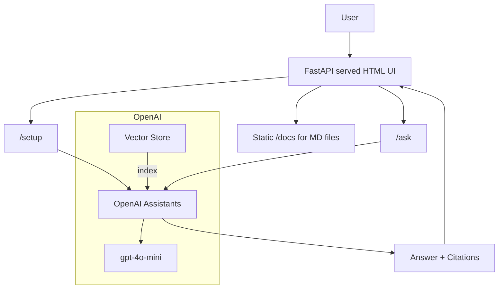

# ERP Help Assistant (OpenAI Assistants + File Search)

Answers questions strictly from your ERP help Markdown files with grounded citations. FastAPI backend with a minimal HTML/JS UI.

Key files:
- [server/main.py](server/main.py) – FastAPI app, OpenAI Assistant and Vector Store setup, chat UI
- [server/requirements.txt](server/requirements.txt) – backend dependencies
- [.env.example](.env.example) – environment template
- [help_docs/](help_docs) – your Markdown knowledge base


## Architecture



- Ingestion: /setup creates a vector store, uploads all files from [help_docs/](help_docs), and creates an Assistant configured to “docs-only”.
- Retrieval + Answering: /ask creates a Thread, runs the Assistant with File Search, and returns the answer with citations to your Markdown files.
- Citations: Clickable links to files under /docs.


## Quickstart

1) Prereqs
- Python 3.10+ recommended
- Git
- OpenAI API Key with active billing

2) Install
```bash
python3 -m venv .venv
./.venv/bin/pip install -U pip
./.venv/bin/pip install -r server/requirements.txt
```

3) Configure
- Copy [.env.example](.env.example) to .env and set your key:
```bash
cp .env.example .env
# edit .env and paste OPENAI_API_KEY=sk-...
```

4) Run
```bash
./.venv/bin/python -m uvicorn server.main:app --host 0.0.0.0 --port 8000 --reload --reload-dir server --reload-exclude ".venv/*" --reload-exclude "*/site-packages/*"
```

5) Use
- Open http://localhost:8000
- Click Setup to index [help_docs/](help_docs)
- Ask: “How do I enter a voucher?”


## API

- Health
  - GET /health → {"status":"ok"}

- Setup (create Assistant + vector store + upload docs)
  - POST /setup
  - Body: {"recreate": false} or {"recreate": true} to force reindex
  - Response: {assistant_id, vector_store_id, files_indexed, files}

- Ask a question
  - POST /ask
  - Body: {"question":"...", "thread_id":"optional-thread-id"}
  - Response: {answer, citations, thread_id, run_id, assistant_id}

- Static docs (for citations)
  - GET /docs/<filename.md>


## Behavior and Guardrails

- Strict grounding: answers only from your docs; otherwise “Not covered in our docs.”
- Citations: show doc titles and link to /docs/<file>
- Assistant model: gpt-4o-mini (change in [server/main.py](server/main.py))


## Project Layout

- [server/main.py](server/main.py): FastAPI app, OpenAI client, in-memory state helpers, UI, routes
- [server/requirements.txt](server/requirements.txt): FastAPI, Uvicorn, OpenAI SDK, etc.
- [help_docs/](help_docs): All Markdown files get indexed
- [.env.example](.env.example): Set OPENAI_API_KEY
- [.gitignore](.gitignore): Ignores .env, venv, caches, and assistant state


## Troubleshooting

- Dev server keeps reloading endlessly
  - Cause: reloader watches site-packages. Use the run command above that limits reloader to [server/](server).
- 404 “Vector store not found”
  - [server/main.py](server/main.py) auto-recovers: if the saved vector store is missing, it recreates the Assistant + vector store at runtime.
- 429/Quota error
  - Add billing or increase limits in your OpenAI org. Code will work once quota is available.
- No answer or missing citations
  - Improve headings/keywords in docs, add glossary acronyms, then re-run /setup with {"recreate": true}.


## GitHub Push Protection – removing leaked secrets

If you accidentally committed your .env with the OpenAI API key, GitHub will block pushes. Do the following:

1) Rotate your OpenAI key immediately
- Create a new key and update [.env](.env) locally.
- Revoke the old key in the OpenAI dashboard.

2) Remove .env from current working tree and commit
```bash
git rm --cached .env
git add .gitignore
git commit -m "chore(security): remove .env from repo and add .gitignore"
```

3) Purge all history of .env
- Preferred: git filter-repo (fast, safe)
```bash
python3 -m pip install git-filter-repo  # or: brew install git-filter-repo
git filter-repo --path .env --invert-paths --force
```

- Fallback: git filter-branch (slow, legacy)
```bash
git filter-branch --force --index-filter \
  "git rm --cached --ignore-unmatch .env" \
  --prune-empty --tag-name-filter cat -- --all
```

4) Force-push rewritten history
```bash
git push origin --force --all
git push origin --force --tags
```

5) Verify push protection is satisfied
- Ensure .env is ignored (see [.gitignore](.gitignore)) and not present in any commit.
- Do NOT approve the bypass link unless absolutely necessary; prefer removing the secret from history.


## Production notes

- Model and cost control:
  - Default is gpt-4o-mini for low cost; change it in [server/main.py](server/main.py).
- Security:
  - Never commit .env or secrets. Keep [.gitignore](.gitignore) as-is.
  - Consider restricting CORS in [server/main.py](server/main.py).
- Deployment:
  - Uvicorn behind a reverse proxy (nginx/Caddy) or use Gunicorn workers:
```bash
./.venv/bin/gunicorn -w 2 -k uvicorn.workers.UvicornWorker server.main:app -b 0.0.0.0:8000
```

## License

Internal use only, unless you choose a public license.


## Acknowledgements

- OpenAI Assistants API with File Search
- FastAPI / Uvicorn