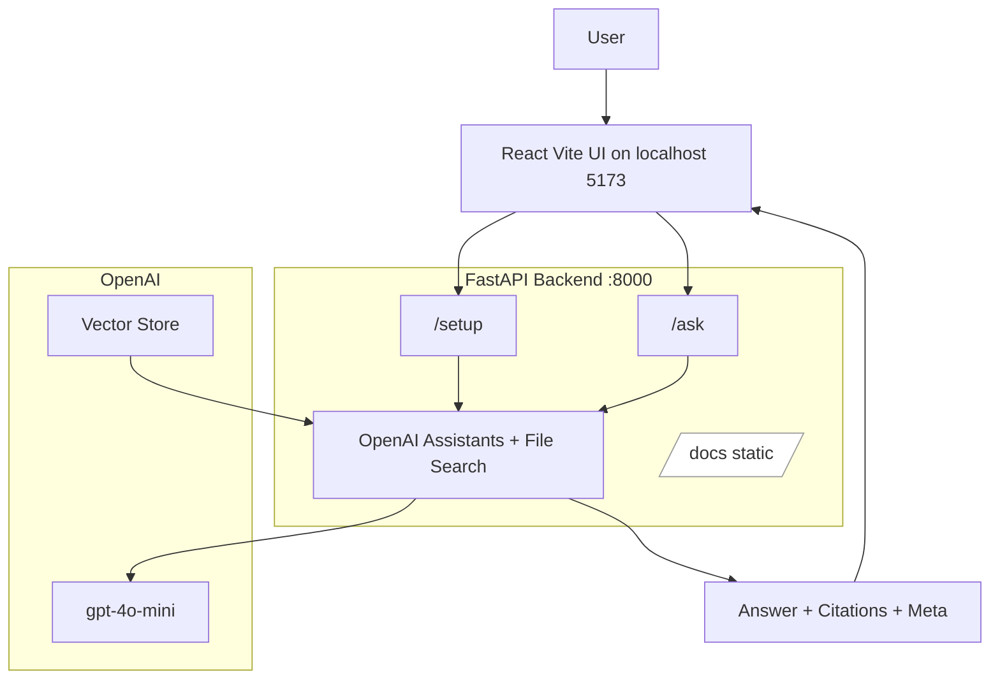

# ERP Help Assistant (OpenAI Assistants + File Search)

Answers questions strictly from your ERP help Markdown files with grounded citations. Backend is FastAPI. Frontend is React + Vite + Tailwind + shadcn-style components. The UI also displays meta info like time, chunks, shots, tokens, and cost.

Key files
- [server app](server/main.py)
- [Python deps](server/requirements.txt)
- [Env template](.env.example)
- [Help docs (Markdown KB)](help_docs)
- [React app](frontend)
  - [Vite config](frontend/vite.config.ts)
  - [Entry HTML](frontend/index.html)
  - [TS config](frontend/tsconfig.json)
  - [App root](frontend/src/App.tsx)
  - [ReactDOM.createRoot()](frontend/src/main.tsx:1)
  - [Tailwind config](frontend/tailwind.config.js)
  - [Global CSS](frontend/src/index.css)
  - [UI primitives: Button](frontend/src/components/ui/button.tsx)
  - [UI primitives: Input](frontend/src/components/ui/input.tsx)
  - [UI primitives: Card](frontend/src/components/ui/card.tsx)
  - [UI primitives: Badge](frontend/src/components/ui/badge.tsx)

What changed in this version
- Removed the inline HTML UI previously served from the FastAPI index route. The API now serves JSON at [/](server/main.py:395).
- Added a React UI with shadcn-style components under [frontend/](frontend).
- Enriched responses from the Ask endpoint with meta: duration, tokens in/out/total, approximate cost, number of chunks (cited sections), and shots. See [ask()](server/main.py:295). The UI shows a line like:
  - “Completed in 0.00s using 0 chunks and 0 shots. Tokens in/out/total: 0/0/0. Cost: $0.000000.”

Architecture



- Ingestion: POST /setup creates or reuses a vector store, uploads all files from [help_docs/](help_docs), and creates an Assistant with File Search.
- Retrieval + Answering: POST /ask creates a Thread, runs the Assistant, and returns answer with citations and meta.
- Citations: Clickable links to the original Markdown files under /docs.

Backend Quickstart

1) Prereqs
- Python 3.10+ recommended
- OpenAI API key with active billing

2) Install backend deps
```
python3 -m venv .venv
./.venv/bin/pip install -U pip
./.venv/bin/pip install -r server/requirements.txt
```

3) Configure env
```
cp .env.example .env
# Edit .env and paste:
# OPENAI_API_KEY=sk-...
```

4) Run FastAPI (dev)
```
./.venv/bin/python -m uvicorn server.main:app --host 0.0.0.0 --port 8000 --reload --reload-dir server --reload-exclude ".venv/*" --reload-exclude "*/site-packages/*"
```

- /health → {"status":"ok"}
- /setup → indexes files and creates Assistant
- /ask → ask a question grounded in your docs
- /docs → static served Markdown for citation links

Frontend Quickstart (React + Vite + shadcn)

1) Install Node deps
```
cd frontend
npm install
```

2) Run Vite dev server
```
npm run dev
```

- Open http://localhost:5173
- The Vite config proxies API calls to the backend at http://localhost:8000 for:
  - /health, /setup, /ask, /docs

3) Use the UI
- Click Setup to index the Markdown files in [help_docs/](help_docs).
- Ask “How do I enter a voucher?”
- The UI will show:
  - The grounded answer
  - Sources (clickable)
  - Meta line: “Completed in Ns using K chunks and S shots. Tokens in/out/total: … Cost: $…”

API Reference

- Health
  - GET /health → {"status": "ok"}

- Setup (create Assistant + vector store + upload docs)
  - POST /setup
  - Body: {"recreate": false} or {"recreate": true} to force reindex
  - Response: {assistant_id, vector_store_id, files_indexed, files}

- Ask a question
  - POST /ask
  - Body: {"question": "...", "thread_id": "optional-thread-id"}
  - Response:
    - answer: string
    - citations: [{ filename, url }]
    - meta:
      - duration_seconds, duration_ms
      - tokens: {input, output, total}
      - cost_usd (approx)
      - chunks (count of citations)
      - shots (fixed 0)
      - model

Backend implementation details

- Assistant creation and vector store upload are implemented in [setup()](server/main.py:278).
- Asking a question is implemented in [ask()](server/main.py:295).
- Runtime meta calculation and cost approximation are added after the run completes (usage tokens may vary by SDK version):
  - Cost uses approximate 2025 pricing for gpt-4o-mini:
    - Input: $0.15 per 1M tokens
    - Output: $0.60 per 1M tokens
  - If usage is unavailable in the SDK response, tokens are reported as 0 and cost rounds to $0.

Editors notes and troubleshooting

- Dev server endlessly reloading
  - Use the provided uvicorn command to restrict watched directories to [server/](server).
- “Vector store not found”
  - [ask()](server/main.py:295) validates the vector store and will recreate Assistant + store if missing.
- 429/Quota error
  - Add billing or increase limits in your OpenAI org. The code will work once quota is available.
- No answer or missing citations
  - Improve headings/keywords, add glossary acronyms to your Markdown, then run /setup with {"recreate": true}.
- CORS
  - CORS is allow_origins ["*"] in dev. Restrict before production in [server.main app config](server/main.py:39).

Security and GitHub Push Protection

- Do not commit secrets. [.gitignore](.gitignore) already ignores .env, .env.*, .venv, caches, dist, node_modules, and [server/assistant_state.json](server/assistant_state.json).
- If a secret was committed:
  1) Rotate the secret in its provider console.
  2) Remove it from the working tree and add to .gitignore.
  3) Rewrite git history to purge the file (e.g., git-filter-repo).
  4) Force push and verify push-protection passes.

Production notes

- Backend
  - Run gunicorn + uvicorn workers or deploy behind a proxy:
    ```
    ./.venv/bin/gunicorn -w 2 -k uvicorn.workers.UvicornWorker server.main:app -b 0.0.0.0:8000
    ```
- Frontend
  - Build and serve the static site:
    ```
    cd frontend
    npm run build
    ```
    Serve the dist/ directory with any static server or behind your API gateway.
  - Optional: host the frontend via the FastAPI app by serving the build output (not implemented here; dev uses Vite proxy).

License

Internal use unless you choose otherwise.

Acknowledgements

- OpenAI Assistants API with File Search
- FastAPI / Uvicorn
- React + Vite + Tailwind + shadcn