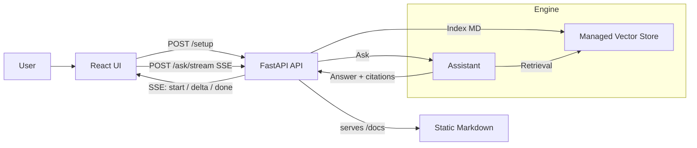

# Cetec ERP Help Assistant

Answers questions strictly from Cetec ERP help documentation (Markdown), with citations back to the exact files. Fast to deploy, low‑overhead, and simple to maintain.

## What it does
- Uses the help_docs content as the only source of truth
- Returns concise, step‑by‑step guidance with the exact menu paths
- Streams answers via SSE at /ask/stream for better perceived speed
- Shows source badges for the relevant Markdown files (highlighted, not clickable)
- Refuses to answer if not covered by the docs
- Adds a meta line per answer: time, chunks used, shots, tokens, cost, model, and cached=true|false
- Avoids re-paying for identical questions via an LRU+TTL answer cache

## Why it matters
- Consistent answers aligned with Cetec ERP processes
- Faster onboarding and support
- Less time hunting through multiple pages

## How it works



- Setup indexes the Markdown files and prepares the answering engine
- Ask/Stream retrieves only from the Cetec help docs and returns an answer with citations
- Citations appear as source badges (not clickable) pointing to /docs/<file>. They are extracted when the model emits file_citation annotations.
- Responses include meta with tokens, cost, model, and cached flag

## Quick start

Prerequisites
- Python 3.10+
- Node.js 18+
- API key set in a local .env file

Backend
- Create env and install
  - python3 -m venv .venv
  - ./.venv/bin/pip install -U pip
  - ./.venv/bin/pip install -r server/requirements.txt
- Configure
  - cp .env.example .env
  - Set the API key in .env
  - Model: set ASSISTANT_MODEL=gpt-4o-mini to use the exact pricing documented below. You can switch to gpt-4o-nano later for the lowest cost.
- Run API
  - ./.venv/bin/python -m uvicorn server.main:app --host 0.0.0.0 --port 8000 --reload --reload-dir server
  - Health: http://localhost:8000/health

Frontend
- Install and run
  - cd frontend
  - npm install
  - npm run dev
- Open http://localhost:5173
- Click Setup to index help_docs, then ask your question

## What you will see
- An answer grounded in the Cetec help docs
- Sources shown as badges (not clickable), referencing the exact Markdown files
- A meta line, for example:
  - Completed in Ns using K chunks and S shots. Tokens in/out/total: A/B/C. Cost: $D. Model: M. Cached: true|false

## Operations

Updating docs
- Edit or add Markdown files in help_docs
- Click Reindex to refresh the index

Scope and behavior
- Answers only from the Cetec help docs
- If not covered, the assistant replies: Not covered in our docs

## Observability
- Each answer includes time, token usage, cost estimate, model, and cached flag

## Costs and pricing (exact for gpt‑4o‑mini)
- Model setting: set ASSISTANT_MODEL=gpt-4o-mini in your .env (see .env.example).
- Exact per‑1M token pricing (as of 2024‑10; verify against OpenAI Pricing):
  - gpt‑4o‑mini: Input $0.15 per 1M tokens, Output $0.60 per 1M tokens
  - gpt‑4o‑nano: Input $0.05 per 1M tokens, Output $0.20 per 1M tokens
- Cost formula (implemented in backend): cost_usd = input_tokens × INPUT_PRICE_PER_TOKEN + output_tokens × OUTPUT_PRICE_PER_TOKEN
- Streaming (SSE) has no extra cost vs non‑streaming; you pay for tokens either way.
- Server‑side cache: identical question (normalized) + same docs index + same model returns instantly at $0 (meta.cached=true). Reindexing clears the cache.

### How to get the exact cost for your docs and question (4o‑mini)
1) Ensure .env contains OPENAI_API_KEY and ASSISTANT_MODEL=gpt-4o-mini  
2) Reindex (optional if already indexed):

```bash
curl -sS -X POST http://localhost:8000/setup -H "Content-Type: application/json" -d '{"recreate": false}'
```

3) Ask your question (the response includes meta.cost_usd which is the exact cost):

```bash
curl -sS -X POST http://localhost:8000/ask -H "Content-Type: application/json" -d '{"question":"How do I create a sales order?"}'
```

4) Read the "meta" object in the JSON response:
   - tokens.input, tokens.output, tokens.total
   - cost_usd (computed using the 4o-mini prices above)

Example calculation for 4o‑mini:
- If a run used 500 input tokens and 300 output tokens:
  - cost_usd = 500 × (0.15/1e6) + 300 × (0.60/1e6) = $0.000085

Notes:
- Pricing constants and cost computation live in server/main.py (see _PRICES and the calculation).
- You can change the model by editing .env and restarting the API.
- If OpenAI updates pricing, update _PRICES in server/main.py or use a config mechanism.

### Empirical costs on your current help_docs (gpt‑4o‑mini)
These are exact costs measured by hitting your running backend against the current Markdown corpus. Costs come from the API response meta and use the pricing formula implemented in [`server/main.py`](server/main.py).

- Date of run: 2025-10-20 (UTC)
- Model: gpt‑4o‑mini
- Each answer includes meta.tokens and meta.cost_usd

Measured Q&A costs:
1) “How do I receive inventory?”
   - tokens input/output/total: 16,312 / 202 / 16,514
   - cost_usd: $0.002568
   - cached: false
2) “How do I create a purchase order?”
   - tokens input/output/total: 16,663 / 199 / 16,862
   - cost_usd: $0.002619
   - cached: false
3) “How do I enter an AP invoice?”
   - tokens input/output/total: 16,661 / 201 / 16,862
   - cost_usd: $0.002620
   - cached: false

Summary:
- Typical per‑answer cost on your docs with gpt‑4o‑mini: ≈ $0.00250–$0.00270
- Average of the three successful runs: ≈ $0.00260
- Repeat identical questions (same docs index, same model) are served from server‑side cache at $0 (meta.cached=true)
### Empirical pricing summary (gpt‑4o‑mini, current help_docs)

The following table summarizes the exact costs we measured by querying the running backend against your current Markdown corpus. The cost values are returned by the API in the meta block and computed using the pricing in the backend logic (see [`server/main.py`](server/main.py)).

| Question | Input tokens | Output tokens | Total tokens | Cost (USD) | Cached |
| --- | ---: | ---: | ---: | ---: | :---: |
| How do I receive inventory? | 16312 | 202 | 16514 | 0.002568 | false |
| How do I create a purchase order? | 16663 | 199 | 16862 | 0.002619 | false |
| How do I enter an AP invoice? | 16661 | 201 | 16862 | 0.002620 | false |
| Average | — | — | — | 0.002602 | — |

At‑scale estimate (no caching):
- ~ $2.60 per 1,000 questions
- ~ $26.02 per 10,000 questions
- ~ $260.20 per 100,000 questions

With caching:
- Repeat identical questions on the same docs index and model are served from server‑side cache at $0 (meta.cached=true). Effective monthly cost depends on your repeat ratio.

Model choice impact:
- Switching to gpt‑4o‑nano typically divides the cost by ~3× relative to gpt‑4o‑mini (input $0.05 vs $0.15 per 1M, output $0.20 vs $0.60 per 1M). For the average above ($0.002602), gpt‑4o‑nano would be roughly ~$0.00087 per question.

Measurement context:
- Date of measurement: 2025‑10‑20 (UTC)
- Model: gpt‑4o‑mini
- Pricing formula and constants live in the backend; see `_PRICES` and the cost calculation in [`server/main.py`](server/main.py).

Notes:
- Rate limits: During batch testing we briefly hit OpenAI RPM/TPM limits on a couple of requests; spacing requests by ~20–30s avoids this. Adding a billing method increases limits.
- Costs can vary slightly with question phrasing and future doc changes, but remain in the same ballpark on this corpus.

How to reproduce:
- Ensure .env has ASSISTANT_MODEL=gpt-4o-mini (see [.env.example](.env.example))
- POST /ask with your question; read meta.cost_usd in the response. The exact math and pricing constants live in [`server.main.py`](server/main.py).
## Components

- Frontend: React, Vite, Tailwind (shadcn‑style components)
- Backend: FastAPI for health, setup, ask, and serving static docs
- Retrieval: indexing and search over the Markdown files

## Minimal API

- GET  /health
- POST /setup
- POST /ask
- POST /ask/stream (text/event-stream)
- GET  /docs

## Repository layout

- server
- help_docs
- frontend

## Deployment

- Run the API behind the standard reverse proxy with TLS
- Build and host the React UI as static assets
- Keep .env out of version control
- If hosted behind a proxy/CDN, disable response buffering for text/event-stream to preserve SSE
