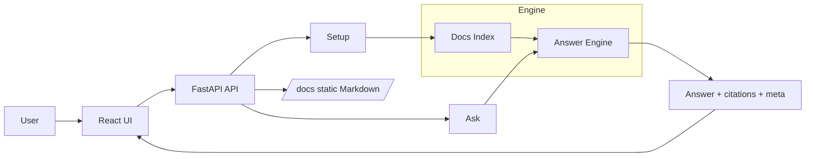

# Cetec ERP Help Assistant

Answers questions strictly from Cetec ERP help documentation (Markdown), with citations back to the exact files. Fast to deploy, low‑overhead, and simple to maintain.

## What it does
- Uses the help_docs content as the only source of truth
- Returns concise, step‑by‑step guidance with the exact menu paths
- Always shows source links to the relevant Markdown files
- Refuses to answer if not covered by the docs
- Adds a meta line per answer: time, chunks used, shots, tokens, and cost

## Why it matters
- Consistent answers aligned with Cetec ERP processes
- Faster onboarding and support
- Less time hunting through multiple pages

## How it works

- Setup indexes the Markdown files and prepares the answering engine
- Ask retrieves only from the Cetec help docs and returns an answer with citations
- Citations link to your Markdown files served by the API at /docs

## Quick start

Prerequisites
- Python 3.10+
- Node.js 18+
- API key set in a local .env file

Backend
- Create env and install
  - python3 -m venv .venv
  - ./.venv/bin/pip install -U pip
  - ./.venv/bin/pip install -r server/requirements.txt
- Configure
  - cp .env.example .env
  - Set the API key in .env
- Run API
  - ./.venv/bin/python -m uvicorn server.main:app --host 0.0.0.0 --port 8000 --reload --reload-dir server
  - Health: http://localhost:8000/health

Frontend
- Install and run
  - cd frontend
  - npm install
  - npm run dev
- Open http://localhost:5173
- Click Setup to index help_docs, then ask your question

What you will see
- An answer grounded in the Cetec help docs
- Sources with clickable links to the exact Markdown files
- A meta line, for example:
  - Completed in Ns using K chunks and S shots. Tokens in/out/total: A/B/C. Cost: $D

## Operations

Updating docs
- Edit or add Markdown files in help_docs
- Click Reindex to refresh the index

Scope and behavior
- Answers only from the Cetec help docs
- If not covered, the assistant replies: Not covered in our docs

Observability
- Each answer includes time and a cost estimate, based on tokens

## Security

- API key stays in .env and is ignored by git
- Direct links to the source Markdown allow quick verification
- Data handling and retention can be configured at the org level

## Components

- Frontend: React, Vite, Tailwind (shadcn‑style components)
- Backend: FastAPI for health, setup, ask, and serving static docs
- Retrieval: indexing and search over the Markdown files

## Minimal API

- GET  /health
- POST /setup
- POST /ask
- GET  /docs

## Repository layout

- server
- help_docs
- frontend

## Deployment

- Run the API behind the standard reverse proxy with TLS
- Build and host the React UI as static assets
- Keep .env out of version control
